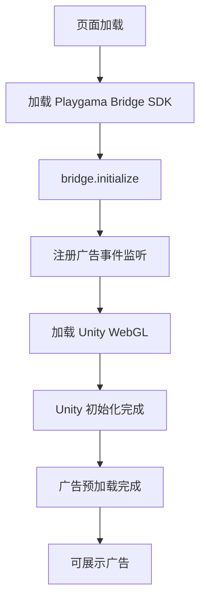

# Mega Jump 广告接入文档

## 项目概述

| 配置项 | 值 |
|--------|------|
| 游戏名称 | Mega Jump |
| 游戏版本 | 1.1.2 |
| 广告框架 | Playgama Bridge + DelmaGameSDK |
| 广告源 | Google AdSense (Adscene) |
| 主要平台 | Game Distribution |
| 游戏 ID | eb3160e4ebf3451a9d2b508f6d905074 |

## 技术架构

### 广告集成方式

| 广告类型 | 集成方式 | 说明 |
|----------|----------|------|
| 插屏广告 | Google Ad Placement API | 通过 DelmaGameSDK → MiniGameAds.showInterstitial() 调用 |
| 激励广告 | Google Ad Placement API | 通过 DelmaGameSDK → MiniGameAds.showRewarded() 调用 |
| 横幅广告 | Google AdSense 直接调用 | 通过 DelmaGameSDK → window.showBanner()/hideBanner() 调用 |

### 核心技术栈

| 层级 | 技术 | 文件/URL |
|------|------|------|
| 游戏引擎 | Unity WebGL | Build/*.unityweb |
| 桥接层 1 | Playgama Bridge | playgama-bridge.js |
| 桥接层 2 | DelmaGameSDK 2.0 | https://play.delmagames.com/DelmaGameSDK2.0.js |
| 广告源 | Google AdSense | https://pagead2.googlesyndication.com/pagead/js/adsbygoogle.js |
| 广告配置 | JSON | playgama-bridge-config.json |
| HTML 入口 | JavaScript | game.html |

## 广告配置

### Google AdSense 实际配置（DelmaGameSDK）

| 配置项 | 值 | 说明 |
|--------|------|------|
| ADSCENE_CLIENT_ID | `pub-2912341234436825` | Google AdSense 发布商 ID |
| BOTTOM_BANNER_SLOT_ID | `9587221844` | 底部横幅广告位 ID |
| 广告脚本 | `adsbygoogle.js` | Google AdSense 官方脚本 |
| 频率控制 | `30s` | `data-ad-frequency-hint="30s"` |

### 预加载配置（Playgama Bridge）

| 广告类型 | 预加载开关 | 配置位置 |
|----------|------------|----------|
| 插屏广告 | `true` | `advertisement.interstitial.preloadOnStart` |
| 激励广告 | `true` | `advertisement.rewarded.preloadOnStart` |

### Placement 参数说明

| 参数 | 类型 | 用途 | 示例 |
|------|------|------|------|
| placement | string | 广告位标识符 | "level_end", "game_over", "reward_double" |

**注意**：
- 插屏和激励广告使用 `window.adBreak()` API，type 分别为 `"next"` 和 `"reward"`
- 横幅广告使用固定的 `BOTTOM_BANNER_SLOT_ID = "9587221844"`
- Playgama Bridge 作为上层抽象，实际广告请求由 DelmaGameSDK 处理

## API 接口

### DelmaGameSDK 实际 API（MiniGameAds）

| 方法名 | 参数 | 返回值 | 说明 |
|--------|------|--------|------|
| `MiniGameAds.preloadAd()` | 无 | Promise | 预加载广告 |
| `MiniGameAds.showInterstitial(config)` | config: object | Promise | 展示插屏广告，type: "next" |
| `MiniGameAds.showRewarded(config)` | config: object | Promise | 展示激励广告，type: "reward" |
| `window.showBanner()` | 无 | void | 展示底部横幅广告 |
| `window.hideBanner()` | 无 | void | 隐藏底部横幅广告 |

### 广告回调配置（config 对象）

| 回调函数 | 触发时机 | 说明 |
|----------|----------|------|
| `beforeAd()` | 广告展示前 | 暂停游戏等操作 |
| `afterAd()` | 广告展示后 | 恢复游戏等操作 |
| `adBreakDone(payload)` | 广告流程完成 | payload.breakStatus 表示关闭状态 |
| `beforeReward(showAdFn)` | 激励广告前 | 调用 showAdFn() 展示广告 |
| `adViewed()` | 激励广告观看完成 | 发放奖励 |
| `adDismissed()` | 激励广告被关闭 | 不发放奖励 |

### Playgama Bridge 接口（上层封装）

### 广告展示接口

| 方法名 | 参数 | 返回值 | 说明 |
|--------|------|--------|------|
| `showInterstitial(placement)` | placement: string | void | 展示插屏广告 |
| `showRewarded(placement)` | placement: string | void | 展示激励广告 |
| `showBanner(position, placement)` | position, placement: string | void | 展示横幅广告 |
| `hideBanner()` | 无 | void | 隐藏横幅广告 |

### 广告状态查询接口

| 方法名 | 返回值 | 说明 |
|--------|--------|------|
| `getInterstitialState()` | string | 获取插屏广告当前状态 |
| `getRewardedPlacement()` | string | 获取激励广告当前 placement |
| `getMinimumDelayBetweenInterstitial()` | number | 获取插屏广告最小间隔时间 |
| `getIsBannerSupported()` | boolean | 是否支持横幅广告 |

### 广告状态事件

| 事件名 | 回调参数 | Unity 接收方法 | 说明 |
|--------|----------|----------------|------|
| `interstitial_state_changed` | state: string | `OnInterstitialStateChanged` | 插屏广告状态变化 |
| `rewarded_state_changed` | state: string | `OnRewardedStateChanged` | 激励广告状态变化 |
| `banner_state_changed` | state: string | `OnBannerStateChanged` | 横幅广告状态变化 |

### 广告控制接口

| 方法名 | 参数 | 说明 |
|--------|------|------|
| `setMinimumDelayBetweenInterstitial(options)` | options: number/string | 设置插屏广告最小间隔 |
| `checkAdBlock()` | 无 | 检测是否启用广告拦截器 |

## Unity 交互机制

### JavaScript → Unity 通信

```javascript
function sendMessageToUnity(name, value) {
    if (window.unityInstance !== null) {
        window.unityInstance.SendMessage("PlaygamaBridge", name, value);
    }
}
```

| 配置项 | 值 |
|--------|------|
| Unity 接收对象 | `PlaygamaBridge` |
| 通信方式 | `unityInstance.SendMessage()` |
| 初始化时机 | Bridge 初始化完成后 |

### Unity → JavaScript 调用

Unity 通过 `Application.ExternalCall` 或 `Application.ExternalEval` 调用：

| Unity 调用 | JavaScript 方法 | 用途 |
|------------|-----------------|------|
| `Application.ExternalCall("showInterstitial", placement)` | `window.showInterstitial()` | 显示插屏广告 |
| `Application.ExternalCall("showRewarded", placement)` | `window.showRewarded()` | 显示激励广告 |
| `Application.ExternalCall("getInterstitialState")` | `window.getInterstitialState()` | 查询广告状态 |

## 接入流程

### 初始化流程



### 广告展示流程

| 步骤 | 操作 | 代码位置 |
|------|------|----------|
| 1 | Unity 调用展示广告 | Unity C# 代码 |
| 2 | 触发 Playgama Bridge 方法 | game.html 465-470行 |
| 3 | Playgama Bridge 内部处理 | playgama-bridge.js |
| 4 | 调用 DelmaGameSDK (MiniGameAds) | DelmaGameSDK2.0.js |
| 5 | 调用 Google Ad Placement API | `window.adBreak()` |
| 6 | 展示 Google AdSense 广告 | 浏览器 |
| 7 | 回调到 MiniGameAds config | DelmaGameSDK2.0.js |
| 8 | 状态回调到 Unity | game.html 156-160行 |

## 平台配置

### 支持的平台

| 平台 | 配置项 | 状态 |
|------|--------|------|
| Game Distribution | gameId | ✅ 已配置 |
| Telegram | adsgramBlockId | ⚠️ 空 |
| Y8 | gameId, adsenseId, channelId | ⚠️ 空 |
| Lagged | devId, publisherId | ⚠️ 空 |

### Game Distribution 配置

```json
{
    "platforms": {
        "game_distribution": {
            "gameId": "eb3160e4ebf3451a9d2b508f6d905074"
        }
    }
}
```

## 文件结构

| 文件 | 用途 | 大小/URL |
|------|------|------|
| `game.html` | HTML 入口，桥接层实现 | 25.7KB |
| `playgama-bridge.js` | Playgama Bridge SDK | 235.8KB |
| `playgama-bridge-config.json` | 广告和平台配置 | 0.8KB |
| `DelmaGameSDK2.0.js` | Delma Game SDK (实际广告处理) | https://play.delmagames.com/DelmaGameSDK2.0.js |
| `adsbygoogle.js` | Google AdSense 官方脚本 | https://pagead2.googlesyndication.com/pagead/js/adsbygoogle.js |
| `Build/` | Unity WebGL 构建文件 | - |
| `StreamingAssets/` | Unity 流式资源 | - |

## 关键代码位置

### DelmaGameSDK 广告配置

**文件**: `https://play.delmagames.com/DelmaGameSDK2.0.js`  
**关键常量**:

```javascript
const ADSCENE_CLIENT_ID = "pub-2912341234436825";
const BOTTOM_BANNER_SLOT_ID = "9587221844";
```

### 插屏广告实现

**文件**: `DelmaGameSDK2.0.js`

```javascript
showInterstitial: (config) => {
    return new Promise((r) => {
        window.adBreak(
            Object.assign(
                {
                    type: "next",
                    adBreakDone: (res) => {
                        console.log(res);
                        r(true);
                    },
                },
                config,
            ),
        );
    });
}
```

### 激励广告实现

**文件**: `DelmaGameSDK2.0.js`

```javascript
showRewarded: (config) => {
    window.adBreak(
        Object.assign(
            {
                type: "reward",
                beforeAd: () => {},
                afterAd: () => {},
                adBreakDone: (res) => {
                    console.log(res);
                },
                beforeReward: (showAdFn) => {
                    showAdFn();
                },
                adDismissed: () => {},
                adViewed: () => {},
            },
            config,
        ),
    );
}
```

### 横幅广告实现

**文件**: `DelmaGameSDK2.0.js`

```javascript
window.showBanner = function () {
    document.getElementById("banner-close").onclick = function () {
        window.hideBanner();
    };
    document.getElementById("banner-container").style.display = "block";
    document.getElementById("bottom-banner").innerHTML =
        `<ins class="adsbygoogle adsbygooglebanner" 
              style="display:block" 
              data-ad-client="${ADSCENE_CLIENT_ID}" 
              data-ad-slot="${BOTTOM_BANNER_SLOT_ID}" 
              data-full-width-responsive="true"></ins>`;
    window.adBreak({});
};
```

### Playgama Bridge 事件监听

**文件**: `game.html`  
**行号**: 156-161

```javascript
bridge.advertisement.on("interstitial_state_changed", (state) =>
    sendMessageToUnity("OnInterstitialStateChanged", state)
);
bridge.advertisement.on("rewarded_state_changed", (state) =>
    sendMessageToUnity("OnRewardedStateChanged", state)
);
```

### 广告展示方法

**文件**: `game.html`  
**行号**: 465-470

```javascript
window.showInterstitial = function (placement) {
    bridge.advertisement.showInterstitial(placement);
};

window.showRewarded = function (placement) {
    bridge.advertisement.showRewarded(placement);
};
```

## 注意事项

| 事项 | 说明 |
|------|------|
| 广告 ID 配置 | ✅ 已配置固定的 Banner Slot ID: `9587221844` |
| Client ID | ✅ 已配置 Google AdSense Client ID: `pub-2912341234436825` |
| 插屏/激励广告 | 使用 `window.adBreak()` API，不直接使用广告位 ID |
| Placement 命名 | Playgama Bridge 层使用，实际由 DelmaGameSDK 处理 |
| 广告间隔 | 脚本标签设置 `data-ad-frequency-hint="30s"` |
| 预加载 | Playgama Bridge 配置启用，DelmaGameSDK 也支持 `preloadAd()` |
| 广告拦截检测 | 使用 `checkAdBlock()` 方法检测 |
| Unity 对象名 | 必须为 `PlaygamaBridge`，否则无法接收回调 |
| 横幅自动显示 | DelmaGameSDK 在 60 秒后自动显示横幅，10 秒后自动隐藏 |

## 调试建议

| 场景 | 方法 |
|------|------|
| 检查广告状态 | 调用 `getInterstitialState()` 查看当前状态 |
| 检测广告拦截 | 调用 `checkAdBlock()` 返回 boolean |
| 查看 SDK 日志 | 浏览器控制台查看 `adBreak` 的 console.log 输出 |
| 验证 Unity 通信 | 检查 `unityInstance` 是否为 null |
| 检查 AdSense 加载 | 查看 Network 面板中 `adsbygoogle.js` 加载状态 |
| 查看横幅容器 | 检查 DOM 中 `#banner-container` 元素 |
| 验证 MiniGameAds | 控制台输入 `window.MiniGameAds` 查看是否初始化 |
